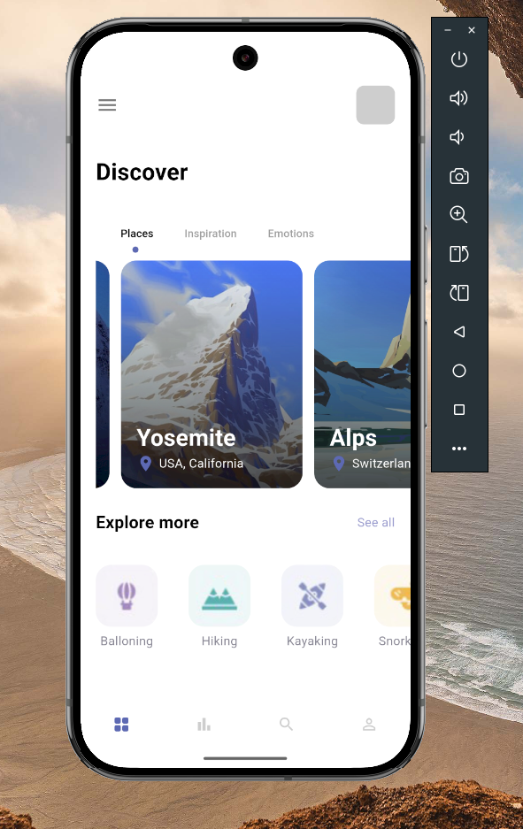
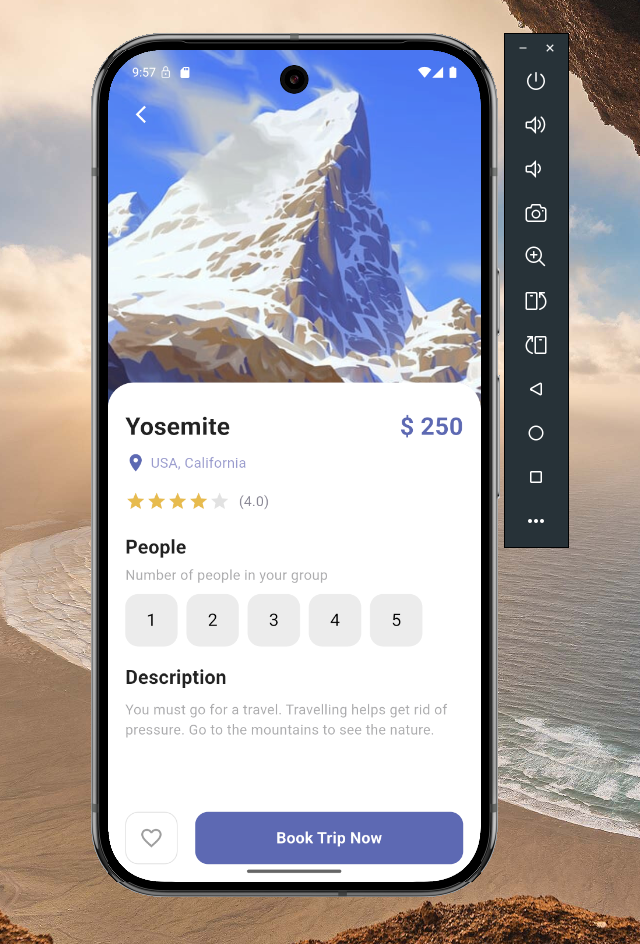
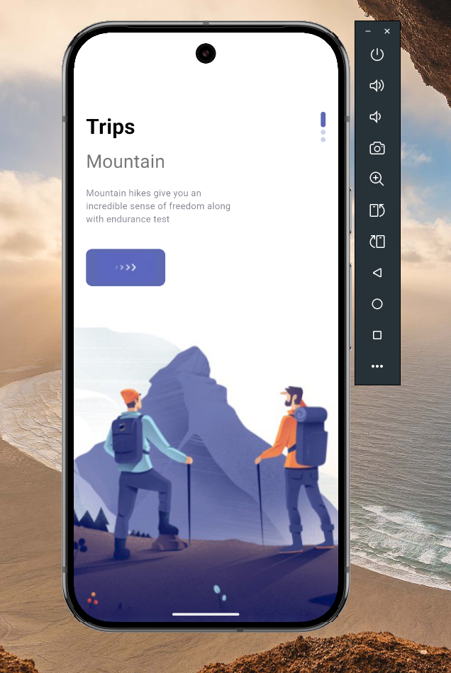

<div align="center">
  
# 🏔️ Mountain Travel Explorer

[](https://flutter.dev/)
[](https://pub.dev/packages/get)
[](https://docs.hivedb.dev/)
[](https://dart.dev)

A stunning Flutter application showcasing mountain destinations with modern UI/UX design patterns

## 📱 App Showcase

### App Demo
<div align="center">
  
</div>

### Screenshots
<div align="center">
  
  
  
</div>

</div>

## 🌟 Project Highlights

This project is a feature-rich mountain travel exploration app built with Flutter, demonstrating:

- 🎨 **Stunning UI Design** with smooth animations and transitions
- 📱 **Responsive Layouts** that work across all screen sizes
- 🏔️ **Rich Content Display** for mountain destinations
- ⚡ **Performance Optimized** for smooth user experience

## 🛠️ Technical Implementation

### Architecture & State Management

- **Project Structure**
  ```
  lib/
  ├── misc/          # Colors and constants
  ├── model/         # Data models
  ├── pages/         # UI screens
  │   └── navpages/  # Navigation pages
  └── widgets/       # Reusable components
  ```

- **Key Features**
  - Custom tab indicators
  - Smooth page transitions
  - Responsive button components
  - Dynamic content loading

### 📱 Core Screens

1. **Welcome Page**
   - Vertical scroll introduction
   - Custom page indicators
   - Smooth navigation transitions

2. **Home Page**
   - TabBar with custom indicators
   - Horizontal scrolling destinations
   - Category exploration section

3. **Detail Page**
   - Rich destination information
   - Interactive booking features
   - Dynamic star ratings
   - People counter selector

4. **Navigation System**
   - Bottom navigation with 4 main sections
   - Custom page transitions
   - Organized navigation structure

### 🎨 UI Components

| Component | Description |
|-----------|-------------|
| `AppLargeText` | Customizable large text widget |
| `AppText` | Standard text with consistent styling |
| `ResponsiveButton` | Adaptive button with animations |
| `AppButtons` | Versatile button components |

## 🚀 Features

<details open>
<summary>💫 Core Features</summary>

- 🎨 **Modern UI Elements**
  - Custom tab indicators
  - Smooth animations
  - Responsive layouts
  
- 📱 **Navigation**
  - Bottom navigation bar
  - Custom page transitions
  - Organized structure
  
- 🎯 **Functionality**
  - Destination exploration
  - Booking system
  - Category filtering
  
- 💅 **Styling**
  - Consistent color scheme
  - Typography system
  - Custom components

</details>

## 🛠️ Technical Stack

- **Framework**: Flutter
- **Language**: Dart
- **Architecture**: Clean Architecture
- **State Management**: GetX (prepared)
- **Local Storage**: Hive (prepared)
- **UI Components**: Custom Widgets

## 🔧 Project Structure

```
lib/
├── misc/
│   └── colors.dart         # Color constants
├── model/
│   └── data_model.dart     # Data structures
├── pages/
│   ├── navpages/          # Navigation screens
│   ├── welcome_page.dart   # Introduction
│   ├── home_page.dart      # Main screen
│   └── detail_page.dart    # Details view
└── widgets/               # Reusable components
```

## 📦 Dependencies

- `flutter_sdk`: Latest stable
- `get`: For state management
- `hive`: For local storage
- Custom animations and transitions

## 🤝 Contributing

Feel free to contribute to this project:

1. Fork the Project
2. Create your Feature Branch
3. Commit your Changes
4. Push to the Branch
5. Open a Pull Request


<div align="center">
  Made with ❤️ using Flutter
</div>